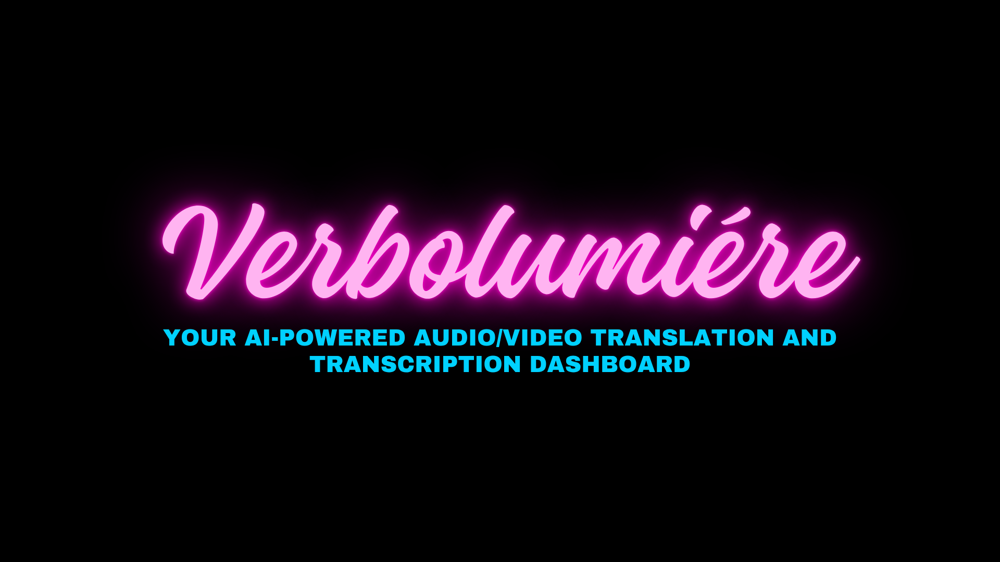
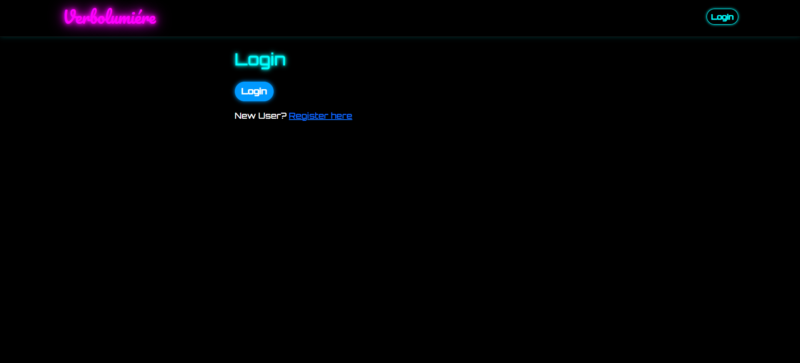
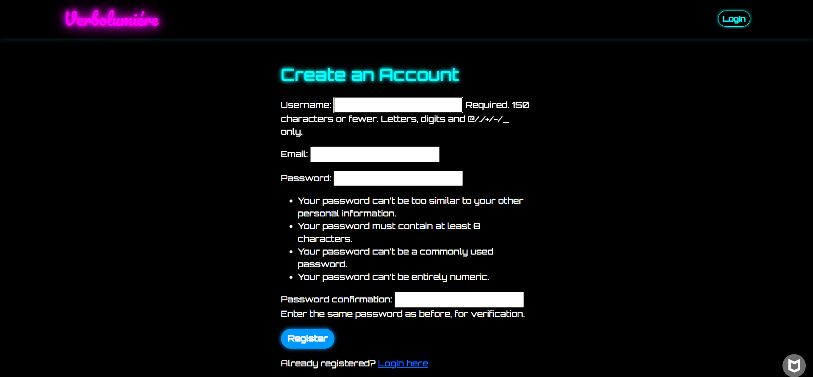
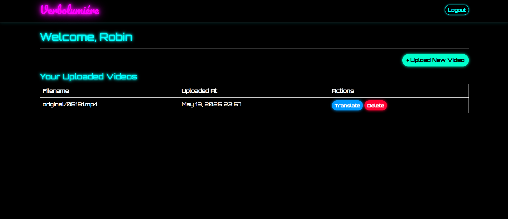
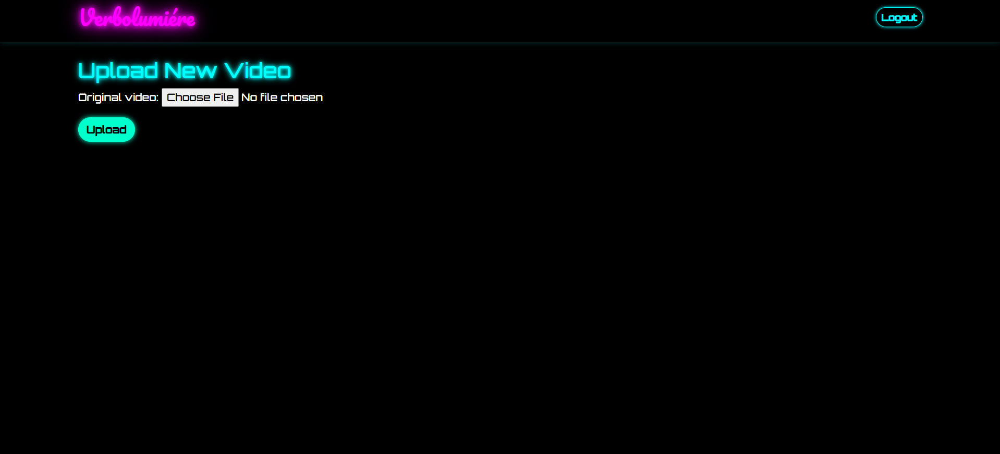
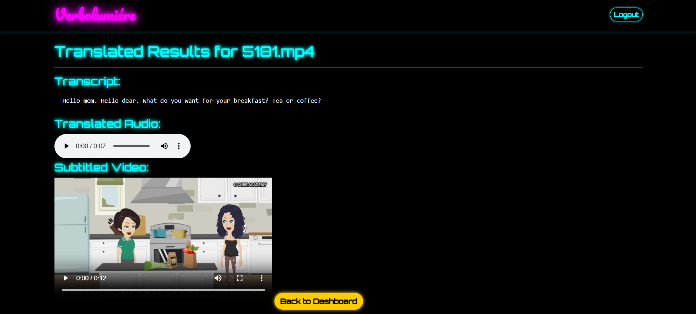

#  VerboLumiére  
*Your AI-powered Audio/Video Translation & Transcription Dashboard*

VerboLumiére is a Django-based web application designed to empower users to upload videos, transcribe their audio using Whisper, translate the transcript into other languages using MarianMT, and generate both translated audio and video content — all through a sleek, neon-themed dashboard.

---

##  Features

###  Upload Videos
Upload your `.mp4` files to the platform and have them automatically queued for processing.

###  Transcription (Whisper by OpenAI)
Once uploaded, the app extracts and transcribes audio using Whisper models.

###  Translation (MarianMT)
The transcribed text is then translated from the source language to English (or other languages if extended), using the MarianMT transformer models.

###  Translated Audio Generation
The translated transcript is converted to speech using TTS models (optionally).

###  Translated Video Overlay
The generated translated audio can be embedded into the original video, creating a dubbed version of the original content.

###  Download Options
- Download transcriptions (plain text)
- Download translated audio (MP3)
- Download translated video (MP4)

###  Video Management
- View uploaded videos with upload timestamps.
- Delete videos and their associated assets easily.
- Secure login/logout with Django's authentication system.

### 🔒 Security with CSRF:
All user interactions are protected against CSRF attacks using Django's built-in middleware.

### 🛠️ Django Admin Panel:
Admins can view/manage all users, videos, translations, and model outputs.
Useful for debugging and moderation

###  Neon-Themed UI
A stunning black background interface with glowing neon pink accents for a visually captivating experience. Mobile-friendly with media queries included.
---
## 📊 Model Performance
VerboLumiere integrates cutting-edge models for transcription and translation, optimized for multilingual and real-world audio/video scenarios.

### 🎙️ Whisper (Large) — Speech-to-Text
Model: openai/whisper-large
Source: OpenAI Whisper
Languages Supported: 100+
Parameters: 1.55 billion
Benchmark Dataset: LibriSpeech, TED-LIUM, Common Voice

Dataset	Metric	Value
LibriSpeech (test-clean)	Word Error Rate (WER)	2.7%
Common Voice (multilingual)	WER	~5–8%
TED-LIUM	WER	~4.1%

### 🧠 Whisper Large is highly robust against background noise, accents, and low-resource languages.

🌐 MarianMT — French to English Neural Translation
Model: Helsinki-NLP/opus-mt-fr-en
Source: MarianMT (HuggingFace)
Languages Supported: French → English
Parameters: 277 million
Training Corpus: OPUS (Open Parallel Corpus)

Task	Metric	Value
French → English Translation	BLEU Score	~39–41

### 🧠 MarianMT is known for high-quality translations and fast inference time, trained on millions of aligned sentence pairs.

These models work seamlessly together in VerboLumiere, enabling real-time or batch processing of spoken French audio into English subtitles, audio, and translated video.
---

## 📸 Screenshots

###  Login Page  


###  Registeration Page  


###  Dashboard  


### 📤 Upload Page  


### 📝 Transcript and Translated Media  


---

##  Tech Stack

- **Backend**: Django 4.x
- **Frontend**: Bootstrap 5, Orbitron Fonts, Neon CSS
- **ML Models**:
  - Whisper (for transcription)
  - MarianMT (for translation)
  - TTS (Text-to-Speech for audio generation)
- **Storage**: FileSystem (media/uploads)
- **Authentication**: Django Auth

---

##  Installation

```bash
git clone https://github.com/yourusername/verbolumiere.git
cd verbolumiere
python -m venv venv
source venv/bin/activate  # or venv\Scripts\activate on Windows
pip install -r requirements.txt
python manage.py migrate
python manage.py runserver
